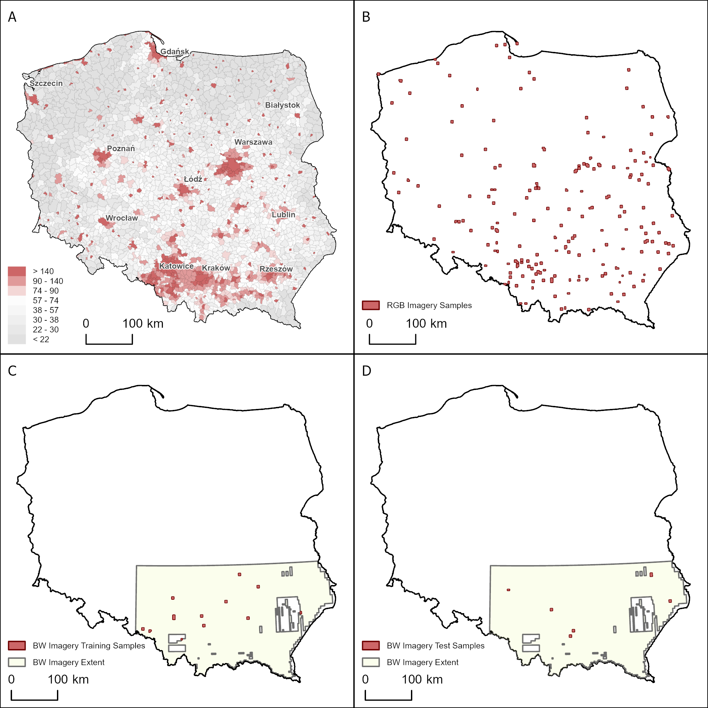
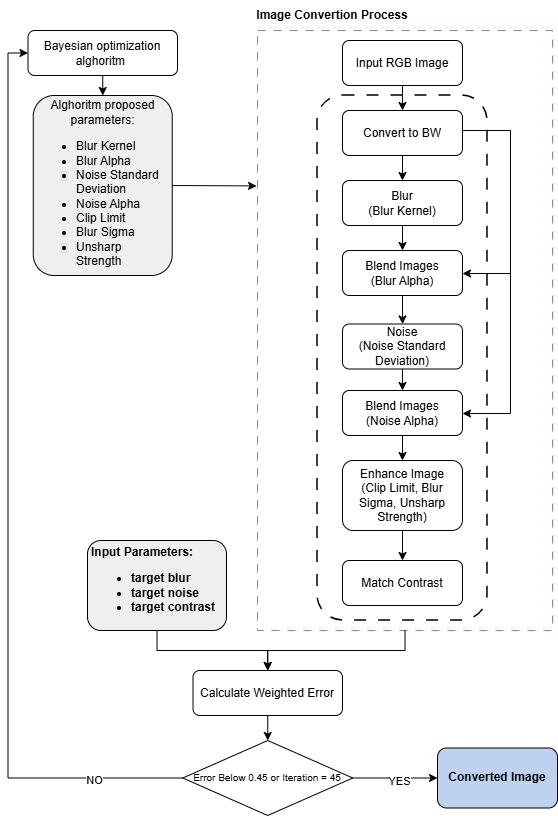
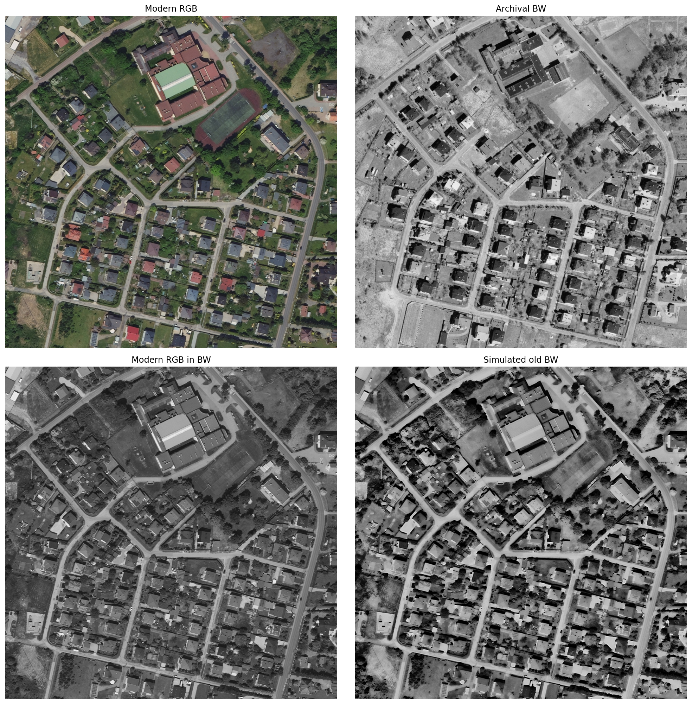
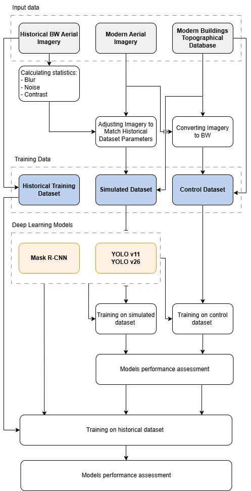

# Bridging the Past and the Present: Using Contemporary Data for Building Detection on Historical Aerial Photographs 

This repository contains code used in the study, that has not been yet officially published. Required information will be added upon the initial acceptance by the journal.

### Samples Selection

### Image conversion process

Conversion results

### Study Design

